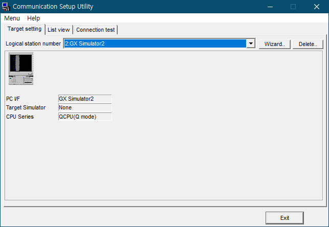
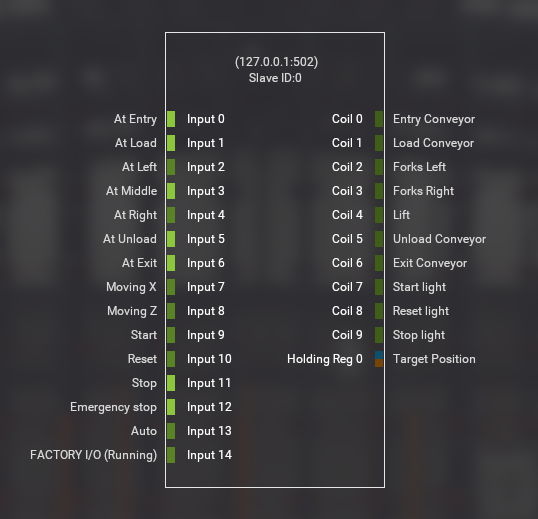

이 방안은 Factory IO를 MODBUS Server로 설정하고, 
MX-Component로 PLC 측의 X/Y/D 디바이스를 MODBUS Input과 Coil 그리고 Register로 중계하는 것이다.
프로그램은 Python으로 할 것이다. 

## 준비

### Factory IO 준비 

우선 Factory IO에 검토에 사용할 'Automated Warehouse' [Scene](https://docs.factoryio.com/manual/scenes/)을 올린다. 

열린 Scene에는 아직 'Drive'가 설정되지 않은 상태다. 
단축키 F4 
메뉴 File-Drives 
혹은 화면의 오른쪽 아래에 칩 모양의 아이콘에 'None'이라고 쓰여 있는 것이 현재 설정된 Drive인데 
여기를 마우스로 눌러도 Drive를 선택할 수 있는 [창](https://docs.factoryio.com/manual/drivers/)으로 바뀐다. 

상단의 DRIVER 선택을 ['Modbus TCP/IP Server'](https://docs.factoryio.com/manual/drivers/modbus-server/)로 바꾼다. 

대부분은 기본으로 설정된 것을 그대로 사용할 것이다. 
오른쪽 상단에 CONFIGURATION를 선택하면 Server에 대한 좀 더 세부적인 설정이 나타나는데 
Slave ID가 0인 것을 확인한다. 아니면 0으로 바꾼다. 
프로그램에 pymodbus라는 라이브러리를 사용할 텐데
이 라이브러리의 Slave ID 기본값이 0이라 번거롭지 않도록 하기 위해서다.
그리고 Network adapter를 Software Loopback Interface로 바꿔서 
Host를 127.0.0.1로 할 것이다.
마찬가지로 pymodbus의 기본값에 맞춰서 번거롭지 않도록 하기 위해서다.

### GX Works2와 MX-Componet4 준비

GX Works2로는 아무 QCPU로 프로젝트 하나를 새로 만들고,
MX-Componet4의 'Communication Setup Utility'로는
'GX Simulator2'을 대상으로 하는 Logical station number를 하나 만든다.
Python 프로그램은 이게 2번이라고 가정할 것이다.



### Python과 pymodbus 준비

[Python](https://www.python.org/)은 [3.9.7](https://www.python.org/downloads/release/python-397/) 버전을 사용할 것이고,
[pymodbus](https://pypi.org/project/pymodbus/)를 추가해 준다.

## 시범

PLC의 디바이스를 중계하기 전에 Modbus만으로 동작을 확인해 볼 것이다.

Factory IO가 Server이므로 Python은 Client가 되어야 하므로
pymodbus의 ModbusTcpClient를 가져온다.

```python
from pymodbus.client.sync import ModbusTcpClient


client = ModbusTcpClient()  # 127.0.0.1:502가 기본값이다.
```

다음에 Coil 하나를 살린 것인데,

```python
client.write_coil(0, 1)
```



연결된 Tag 지도를 보면 'Coil 0'이 'Entry Conveyor'다.
따라서 'Coil 0'에 1을 쓰면 'Entry Conveyor'가 동작할 것이다.

`test.py`는 'Coil 0'을 On 시켰다가 2초 후에 Off 시킨다.

Factory IO에서 Scene을 실행시키고, `test.py`을 실행시키면
'Entry Conveyor'가 동작해서 Pallet가 움직이는 것을 확인할 수 있다.
